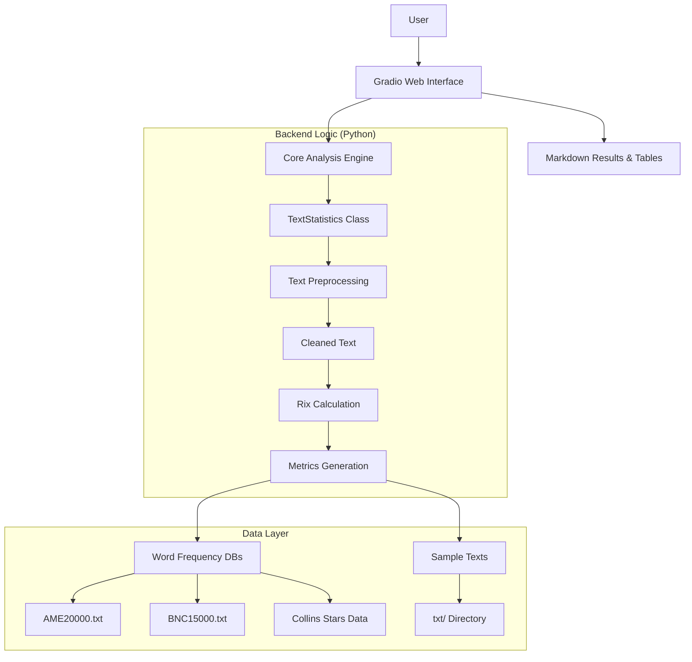

https://gitee.com/leafv1972/rix

https://github.com/Leafv1972/rix

 **_Note that Python 3.12.10 cannot be used on Windows 7 or earlier._** 

# Rix English Text Readability Analysis System: A Review of Theory, Implementation, and Applications

## Abstract

This paper systematically introduces an English text readability analysis tool based on the **Rix (Rate of Long Words Index)** index. Derived from the classic theory proposed by Jonathan Anderson (1983), this tool has been engineered using modern Python technology stacks, specifically the `textstat` library and the `Gradio` framework. This paper details the mathematical principles of the Rix index and its grading standards, and analyzes the system's advantages over traditional formulas (Flesch, SMOG, Fry) in terms of discrimination for low-grade texts and computational efficiency. Furthermore, it highlights the system's software architecture and core functional features, including the integration of multi-source frequency databases, a Gradio web interface, and batch analysis capabilities, while providing detailed installation and usage instructions. The research aims to provide educators, publishers, and NLP researchers with an efficient, accurate, and user-friendly solution for text difficulty assessment.

---

## 1. Introduction

### 1.1 Background
In the fields of language education and natural language processing, accurately assessing text reading difficulty is crucial. Traditional readability formulas such as Flesch-Kincaid, SMOG, and the Fry Graph are widely used but often suffer from cumbersome calculations, low discrimination for early-grade texts ("floor effects"), or excessive dependence on syllable counting.

### 1.2 Proposal of the Rix Index
In 1983, Jonathan Anderson published an article in the *Journal of Reading*, introducing the Lix formula originating from Sweden and proposing its simplified version—the **Rix Index**. Rix is defined as the ratio of the number of long words (7 letters or more) to the number of sentences. Anderson and subsequent researcher Joseph Kretschmer (1984) demonstrated that Rix not only calculates extremely fast but also outperforms mainstream formulas in distinguishing difficulty levels in lower elementary grades.

### 1.3 System Objectives
The project **"Rix English Text Analyzer"** aims to transform this classic theory into a modern web application. By integrating the `textstat` algorithm library and a `Gradio` frontend, and introducing the BNC, AME, and Collins star-dictionary data, the system provides not only basic difficulty scores but also multi-dimensional vocabulary frequency analysis. This helps users deeply understand the composition of text complexity.

---

## 2. Theoretical Analysis of the Rix Index

### 2.1 Definition and Calculation
The core formula for the Rix index is:

$$ \text{Rix} = \frac{\text{Number of Long Words (≥7 letters)}}{\text{Number of Sentences}} $$

*   **Long Words**: Defined as words with a length greater than or equal to 7 letters (e.g., *understand*, *environment*, *necessary*).
*   **Sentences**: Text units separated by punctuation marks (. ! ?).

### 2.2 Grade Level Mapping
Based on the research of Anderson and Kretschmer, the correspondence between Rix values and educational grade levels is as follows:

| Rix Score Range | Estimated Grade Level | Text Characteristic Description |
| :--- | :--- | :--- |
| **< 0.2** | Grade 1 (1st) | Very simple, suitable for early readers. Very few long words. |
| **0.2 - 0.5** | Grade 2 (2nd) | Simple, introductory reading level. |
| **0.5 - 0.8** | Grade 3 (3rd) |初级, beginning to introduce a small number of complex vocabulary. |
| **0.8 - 1.3** | Grade 4 (4th) | Moderate to easy, typical late elementary level. |
| **1.3 - 1.8** | Grade 5 (5th) | Moderate, standard difficulty for formal learning stages. |
| **1.8 - 2.4** | Grade 6 (6th) | Moderate to hard, lower middle school level. |
| **2.4 - 3.0** | Grade 7 (7th) | Hard, typical range for middle school. |
| **3.0 - 3.7** | Grade 8 (8th) | Quite hard, containing more professional terminology. |
| **3.7 - 4.5** | Grade 9 (9th) | Difficult, early high school level. |
| **4.5 - 5.3** | Grade 10 (10th) | Very difficult, late high school level. |
| **5.3 - 6.2** | Grade 11 (11th) | Extremely difficult, college-preparatory level. |
| **6.2 - 7.2** | Grade 12 (12th) | Introductory higher education level. |
| **≥ 7.2** | College | University level and above, academic or professional literature. |

### 2.3 Advantages and Limitations
*   **Advantages**:
    1.  **Extremely Fast Calculation**: Requires no syllable counting, only letter counting and sentence segmentation.
    2.  **High Sensitivity at Lower Grades**: In grades 1-3, Rix effectively distinguishes subtle difficulty differences, whereas SMOG/Fry often fail to distinguish them (both showing as Grade 1 or 2).
    3.  **Objectivity**: Avoids subjective errors associated with manual syllable division.
*   **Limitations**:
    1.  **Ignores Short Hard Words**: Short but difficult words like *anxiety* or *oblique* are not captured. *(This system partially mitigates this defect through Collins Star data)*
    2.  **Length Bias**: Long words are not necessarily hard (e.g., *banana*), and short words are not necessarily easy. *(This system provides additional reference through AME/BNC word frequency data)*

---

## 3. System Architecture and Design

This system adopts a front-end and back-end separated architecture, built on the Python ecosystem, ensuring high performance, scalability, and user-friendliness.

### 3.1 Software Architecture Diagram



### 3.2 Technology Stack

 **_Note that Python 3.12.10 cannot be used on Windows 7 or earlier._** 

*   **Backend**: Python 3.12+
    *   `textstat`: Provides underlying text statistical support.
    *   `re` (Regex): Used for high-performance regex cleaning and sentence segmentation.
    *   `collections.Counter`: Used for efficient word frequency statistics.
*   **Frontend**: Gradio 6.10
    *   Provides an interactive Web UI, supporting real-time analysis, file uploads, and visualization.
*   **Data Sources**:
    *   **BNC15000.txt**: The top 15,000 high-frequency words from the British National Corpus.
    *   **AME20000.txt**: The top 20,000 high-frequency words from American English.
    *   **Collins Star Files**: Collins Dictionary star word list (0-5 stars), used to assess word commonality.

---

## 4. Detailed Feature Description

### 4.1 Core Analysis Capabilities
1.  **Rix Index Calculation**: Automatically counts the number of long words and sentences, calculates the Rix value, and maps it to the corresponding grade level.
2.  **Multi-dimensional Statistics**:
    *   Total Words
    *   Sentences
    *   Number of Long Words (≥7 chars)
3.  **Vocabulary Frequency Enhanced Analysis**:
    *   For each identified long word, the system queries AME and BNC rankings.
    *   Matches against Collins Stars (1-5 stars), helping users determine if a vocabulary is "long but common" or "long and rare."
4.  **Real-time Feedback**: The Gradio interface supports real-time display of analysis results as the user types (bound via the `input_text.change` event).

### 4.2 User Interaction Interface
*   **Text Input**: Supports direct pasting of text or uploading `.txt` files.
*   **File Upload**: Built-in automatic encoding detection (UTF-8, GBK, Big5, etc.) ensures cross-platform file compatibility.
*   **Preset Sample Library**: Includes multiple example texts (e.g., BBC News, sci-fi snippets) for users to quickly test system functionality.
*   **Result Display**:
    *   **Overview Table**: Clearly displays the Rix value, corresponding grade level, and key statistical indicators.
    *   **Long Word List**: Lists all long words in a Markdown table, accompanied by frequency and star information, facilitating editors in identifying difficult vocabulary.

### 4.3 Data Processing Workflow
1.  **Loading**: Loads AME, BNC, and Collins data into memory (`dict` and `set`) at startup to ensure O(1) time complexity for subsequent queries.
2.  **Cleaning**: Removes punctuation marks (retaining apostrophes to maintain word integrity).
3.  **Sentence Segmentation**: Uses regex `\b[^.!?]+[.!?]*` to split sentences.
4.  **Tokenization**: Splits text by spaces.
5.  **Statistics**:
    *   Calculates total sentences.
    *   Filters words with length ≥7.
    *   Queries databases for frequency information.
6.  **Rendering**: Generates HTML in Markdown format and returns it to the frontend.

---

## 5. Installation and Usage Guide

### 5.1 Environment Requirements
*   **Operating System**: Windows / macOS / Linux
*   **Python Version**: 3.12.10 or higher
*   **Dependencies**:
    ```bash
    pip install gradio textstat
    ```

### 5.2 Project Structure
```text
rix/
├── textstat_gradio610_webui.py      # Basic version main program
├── textstat_gradio_webui610_stars.py # Main program with star rating
├── BNC15000.txt                     # BNC word frequency data
├── AME20000.txt                     # AME word frequency data
├── Collins5Stars.txt ~ Collins0Stars.txt # Collins star data
├── txt/                             # Directory for preset sample texts
│   ├── BBC_Memory of a generation...txt
│   ├── The Sudden Death of a Man...txt
│   └── ...
├── !!!!!!!gradio_webui - 7860.bat   # Windows startup script (Basic)
├── !!!!!!!gradio_webui - 7860 - stars.bat # Windows startup script (Stars)
└── !!!!!!!7860_clean.bat            # Clean cache startup script
```

### 5.3 Quick Start
1.  **Clone/Download** the project code.
2.  **Ensure data files** are located in the project root or correct path.
3.  **Run startup script**:
    *   Double-click `!!!!!!!gradio_webui - 7860.bat` (Basic Version)
    *   Or `!!!!!!!gradio_webui - 7860 - stars.bat` (Stars Version)
4.  **Browser Access**: The program will automatically open the Web interface at `http://127.0.0.1:7860`.

### 5.4 Usage Example
1.  **Input Text**:
    > "The environmental impact of industrialization is profound. Scientists argue that sustainable practices are necessary for future generations."
2.  **Analysis Result**:
    *   **RIX Index**: ~1.5 (Assuming 2 sentences, long words are *environmental, industrialization, sustainable, generations* -> 4/2 = 2.0, specific value depends on sentence segmentation)
    *   **Reading Level**: Grade 6-7 Range
    *   **Long Words**: *environmental* (AME Rank: 5000, Collins: ★★★★☆), *industrialization* (AME Rank: 15000, Collins: ★★★☆☆) ...

---

## 6. Discussion and Comparison

### 6.1 Comparison with Traditional Formulas

| Feature | Flesch-Kincaid | SMOG | Fry Graph | **This Rix System** |
| :--- | :--- | :--- | :--- | :--- |
| **Calculation Complexity** | High (Requires syllables) | Medium (Lookup/Formulas) | Medium (Graph Lookup) | **Very Low (Only length+segmentation)** |
| **Low-End Discrimination** | Poor (Floor effect) | Poor (Floor effect) | Poor (Floor effect) | **Excellent (Distinguishes G1-G2 in 0.2-0.5 range)** |
| **Vocabulary Insight** | None | None | None | **Strong (AME/BNC/Collins)** |
| **Implementation Difficulty** | High | Medium | High | **Low (Python Script)** |
| **Applicable Scenarios** | General Purpose | Academic/Formal | Educational Publishing | **Real-time Editing / Batch Processing** |

### 6.2 Importance of Multi-source Word Frequency Data
Traditional Rix only looks at length. This system, by integrating:
*   **BNC (British)** and **AME (American)**: Distinguishes difficulty perception between British and American English. For example, some words are high-frequency (easy) in British English but low-frequency (hard) in American English.
*   **Collins Stars**: Provides a "commonality" rating for vocabulary. A long word that is 5 stars (e.g., *understand*) presents far less reading obstacle than a 0-star word (e.g., *pneumonoultramicroscopicsilicovolcanoconiosis*).

### 6.3 Limitations
*   **Not Applicable to Chinese**: Rix is based on letter length; Chinese has no letters, requiring stroke count or character frequency instead.
*   **Lack of Context**: Cannot identify words that "look simple but are complex in context" (e.g., the difficulty difference of *bank* in financial vs. river contexts).

---

## 7. Conclusion

This system successfully transforms the Rix Index theory proposed by Jonathan Anderson into a powerful, user-friendly modern Web application. By integrating the `textstat` algorithm library and `Gradio` frontend, and introducing multi-dimensional word frequency data, the system retains the core advantages of the Rix index—**extremely fast calculation and high sensitivity at lower grades**—while弥补ing (compensating for) its single-dimensional limitation through **vocabulary frequency and star analysis**.

For educators, publishers, and content creators, this system provides a text difficulty assessment tool that is more fine-grained than traditional formulas and more transparent than complex NLP models. Future work may include support for more languages, integration of context-aware models, and expansion into an API service.

---

## References

1.  Anderson, J. (1983). Lix and Rix: Variations on a Little-known Readability Index. *Journal of Reading*, 26(6), 490-496.
2.  Kretschmer, J. C. (1984). Computerizing and Comparing the Rix Readability Index. *Journal of Reading*, 27(6), 490-499.
3.  Björnsson, C. H. (1968). *Läsbarhet*. Stockholm: Bokförlaget Liber.
4.  McLaughlin, G. H. (1969). SMOG Grading—A New Readability Formula. *Journal of Reading*, 12(8), 639-646.
5.  Fry, E. (1968). A Readability Formula that Saves Time. *Journal of Reading*, 11(7), 513-516.
6.  Harrison, C. (1980). *Readability in the Classroom*. Cambridge: Cambridge University Press.
7.  Rudolf Flesch, *The Art of Readable Writing*.
8.  John Maguire, *The Readable Writing Guide*. https://www.youtube.com/watch?v=TUz4tjSVn4w
9.  Gradio Documentation. https://www.gradio.app/
10. Textstat Library. https://github.com/fnl/textstat

---

**License Information**
This project is open-source based on the `textstat.py` library license. For specific license information, please see the file header of the text statistics module or the LICENSE file in the project root. Word frequency data (BNC, AME, Collins) is protected by the copyright of its respective sources and is for research and educational use only.

---
**Appendix 1: Rix Grading Quick Reference Table (Based on Kretschmer, 1984)**

| Rix Score Range | Estimated Grade Level |
| :--- | :--- |
| < 0.20 | 1st Grade |
| 0.20 - 0.49 | 2nd Grade |
| 0.50 - 0.79 | 3rd Grade |
| 0.80 - 1.29 | 4th Grade |
| 1.30 - 1.79 | 5th Grade |
| 1.80 - 2.39 | 6th Grade |
| 2.40 - 2.99 | 7th Grade |
| 3.00 - 3.69 | 8th Grade |
| 3.70 - 4.49 | 9th Grade |
| 4.50 - 5.29 | 10th Grade |
| 5.30 - 6.19 | 11th Grade |
| 6.20 - 7.19 | 12th Grade |
| >= 7.20 | College |

*(Note: This table is an approximate mapping based on the logic of the original document. In practical applications, it is recommended to judge in combination with the specific text context.)*

**Appendix 2: Converting the **RIXRATE** program (BASIC) provided in Joseph C. Kretschmer's document to a modern **Python** program**

The Python script preserves the core logic of the original BASIC program:
1.  **Real-time Statistics**: Input sentences one by one, displaying statistical results in real time.
2.  **Long Word Definition**: Word length > 6 (i.e., 7 letters or more).
3.  **Rix Formula**: `Rix = Total Long Words / Total Sentences`.
4.  **Grade Mapping**: Maps to corresponding grade levels based on the Rix value.

### Python Code Implementation

```python
import sys
import os

class RixAnalyzer:
    def __init__(self):
        # Initialize statistical variables
        self.total_words = 0
        self.num_sentences = 0
        self.num_long_words = 0
        self.current_word_len = 0
        self.running_text_title = ""
        
        # Mapping table from Rix to Grade Level (based on the BASIC logic in the original document)
        # Original logic: 
        # RX < .2 -> G=1
        # RX < .5 -> G=2
        # ...
        # RX > 7.2 -> G=13 (College)
        self.grade_levels = [
            {"max_rx": 0.2, "grade": 1},
            {"max_rx": 0.5, "grade": 2},
            {"max_rx": 0.8, "grade": 3},
            {"max_rx": 1.3, "grade": 4},
            {"max_rx": 1.8, "grade": 5},
            {"max_rx": 2.4, "grade": 6},
            {"max_rx": 3.0, "grade": 7},
            {"max_rx": 3.7, "grade": 8},
            {"max_rx": 4.5, "grade": 9},
            {"max_rx": 5.3, "grade": 10},
            {"max_rx": 6.2, "grade": 11},
            {"max_rx": 7.2, "grade": 12},
            {"max_rx": float('inf'), "grade": "College"}
        ]

    def clear_screen(self):
        """Cross-platform screen clearing"""
        os.system('cls' if os.name == 'nt' else 'clear')

    def get_grade_from_rix(self, rix_value):
        """Find the corresponding grade based on the Rix value"""
        for level in self.grade_levels:
            if rix_value < level["max_rx"]:
                return level["grade"]
        return "College"

    def update_stats_and_print(self):
        """Update status and print current statistical information"""
        if self.num_sentences == 0:
            avg_sentence_len = 0
        else:
            avg_sentence_len = self.total_words / self.num_sentences
            
        # Calculate Rix value
        if self.num_sentences == 0:
            rix_val = 0
        else:
            rix_val = self.num_long_words / self.num_sentences
            
        current_grade = self.get_grade_from_rix(rix_val)
        
        # Format output, trying to simulate the screen layout of the original BASIC program
        print("-" * 50)
        print(f"TEXT: {self.running_text_title}")
        print(f"TOTAL WORDS: {self.total_words}")
        print(f"NO. SENTENCES: {self.num_sentences}")
        print(f"NO. LONG WORDS (>6 chars): {self.num_long_words}")
        print(f"AV. SENT. LENGTH: {avg_sentence_len:.1f}")
        print(f"Rix SCORE: {rix_val:.2f}")
        print(f"ESTIMATED GRADE LEVEL: {current_grade}")
        print("-" * 50)
        
        # Simulate a small delay from the original program for clearer updates
        # time.sleep(0.5) 

    def run(self):
        """Main program loop"""
        self.clear_screen()
        print("RIXRATE READABILITY PROGRAM")
        print("BASED ON THE RIX FORMULA")
        print("BY J. ANDERSON")
        print("PYTHON PORT BY ASSISTANT")
        print()
        
        # Get text title
        try:
            title = input("Enter a short title for the text (9 chars max): ")
        except EOFError:
            return
            
        # Limit title length to match original program logic (though not strictly necessary in Python)
        self.running_text_title = title[:9]
        
        self.clear_screen()
        print("Instructions:")
        print("1. Type sentences one by one.")
        print("2. Press ENTER to finish a sentence.")
        print("3. Use spaces between words.")
        print("4. Omit punctuation except apostrophes and hyphens.")
        print("5. Press Ctrl+C to exit.")
        print("-" * 50)
        
        try:
            while True:
                # Get user input
                try:
                    sentence = input(">> Enter sentence: ")
                except EOFError:
                    break
                
                if not sentence:
                    continue

                # Process input: Convert to uppercase to match original program logic, strip whitespace
                sentence = sentence.upper().strip()
                
                # Simple tokenization processing
                # Original BASIC program split words by checking space CHR$(32)
                # Here we simulate the same logic: split by space
                words = sentence.split(' ')
                
                for word in words:
                    if word:
                        self.total_words += 1
                        # Calculate word length
                        # Original program logic: L = L + 1; IF L > 6 THEN LW = LW + 1; L = -30
                        # This means as long as word length >= 7, it counts as a long word
                        if len(word) > 6:
                            self.num_long_words += 1
                
                # Each input line (pressing Enter) is considered the end of a sentence
                self.num_sentences += 1
                
                # Update display
                self.update_stats_and_print()
                
        except KeyboardInterrupt:
            print("\n\nProgram interrupted.")
        except Exception as e:
            print(f"\nAn error occurred: {e}")

if __name__ == "__main__":
    analyzer = RixAnalyzer()
    analyzer.run()
```

### Code Explanation and Comparison

1.  **Variable Correspondence**:
    *   BASIC `W` (Total Words) -> Python `self.total_words`
    *   BASIC `S` (Number of Sentences) -> Python `self.num_sentences`
    *   BASIC `LW` (Long Words) -> Python `self.num_long_words`
    *   BASIC `L` (Current Word Length Counter) -> Python processes directly via `len(word)`, which is equivalent to the original program's cumulative judgment `IF L > 6 THEN...`.

2.  **Long Word Definition**:
    *   Original BASIC code: `IF L > 6 THEN LW = LW + 1`. This means the counter increments when the letter count exceeds 6 (i.e., when the 7th letter exists). Therefore, words with **7 or more letters** are defined as long words.
    *   Python code: `if len(word) > 6:` fully implements this logic.

3.  **Grade Level Mapping**:
    *   Original BASIC code used a series of `IF RX < x THEN G = y` statements.
    *   Python code refactors this into the `self.grade_levels` list, with identical logic:
        *   `RX < 0.2` -> Grade 1
        *   `RX < 0.5` -> Grade 2
        *   ...
        *   `RX > 7.2` -> College

4.  **Interaction Mode**:
    *   The original program was character-stream based (reading character by character).
    *   The Python program uses line-based input (reading line by line), which is more natural for modern terminal interaction. Since the core statistical unit of the original program is the "sentence," and users typically input sentences by line, this mapping is safe. Each time Enter is pressed, the program updates the statistics, consistent with the original program's behavior of "Press ENTER... statistics... are immediately updated."

### How to Use

1.  Ensure you have Python 3 installed.
2.  Save the above code as `rixrate.py`.
3.  Run in the terminal or command prompt:
    ```bash
    python rixrate.py
    ```
4.  Follow the prompts to input a text title, then input the text you want to analyze sentence by sentence. Each time you press Enter, the screen refreshes to display the current Rix score and estimated grade.
5.  Press `Ctrl+C` to exit the program.

### Main Differences from the Original Program (Modernization Improvements)

*   **Punctuation Handling**: The original BASIC program required users to manually omit punctuation (except apostrophes and hyphens) because it lacked an internal regex parser. This Python version uses simple `split(' ')` tokenization. If you input punctuation (e.g., "hello,"), it will be counted as part of the text (length becomes 6, not a long word; if it becomes "hello,!", length is 7, so it counts as a long word). **To achieve results perfectly consistent with the original research, it is recommended to remove punctuation when inputting, or add `strip()` and punctuation removal logic in the code.**
    *   *Optional Improvement*: If more precise matching is needed, add the following in the `for word in words:` loop:
        ```python
        word = word.strip(".,!?;:\"'")
        if not word: continue
        ```
*   **Screen Refresh**: The original program precisely positioned the cursor on the TRS-80 using `PRINT@`. The Python version uses simple multi-line printing. If you wish to achieve a similar "in-place update" effect in the terminal, you can use ANSI escape sequences, but for academic research and daily analysis, multi-line printing is clearer and less prone to errors.